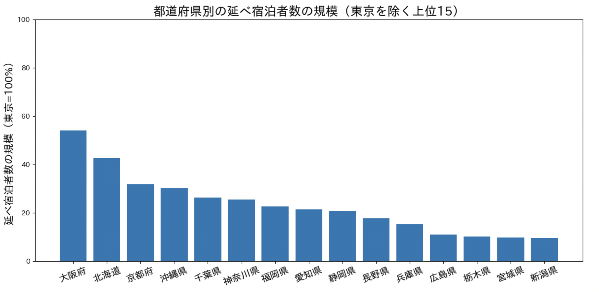
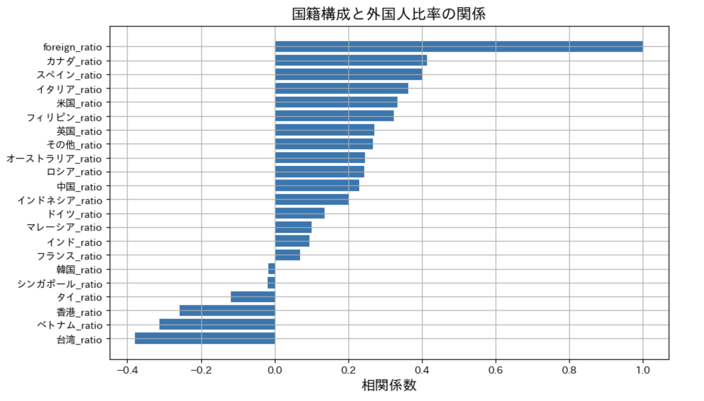

# Regional Concentration of Inbound Tourism in Japan

Data Source: Japan Tourism Agency（観光庁）Accommodation Travel Statistics（宿泊旅行統計調査）

2025年（令和7年）1月~12月分（年間の速報値) 集計結果：
https://www.mlit.go.jp/kankocho/tokei_hakusyo/shukuhakutokei.html

## Foreign Tourist Ratio by Prefecture (Top 10, 2025)

This figure shows the share of foreign tourists in total overnight stays by prefecture in 2025 (top 10).

Tokyo and Kyoto record the highest ratios at around 55%, followed by Osaka at over 40%. 
In contrast, most other prefectures fall within the 20–30% range.

## Tourism Scale by Prefecture (Top 15, excluding Tokyo)

This figure compares the scale of tourism across prefectures using total guest nights, normalized to Tokyo (=100%).
### Key Observations
- Osaka and Hokkaido show the largest tourism scale outside Tokyo, indicating strong nationwide attraction.
- Kyoto and Okinawa form a second tier, reflecting their established positions as major tourist destinations.
- Prefectures in the Greater Tokyo Area (e.g., Chiba, Kanagawa) and regional hubs (e.g., Fukuoka, Aichi, Shizuoka) also maintain substantial tourism volumes.

The distribution suggests that tourism in Japan is not purely concentrated in a single region, but rather supported by multiple regional centers.

## The Correlation between “Nationality Composition” and “the Proportion of Foreign Tourists”

