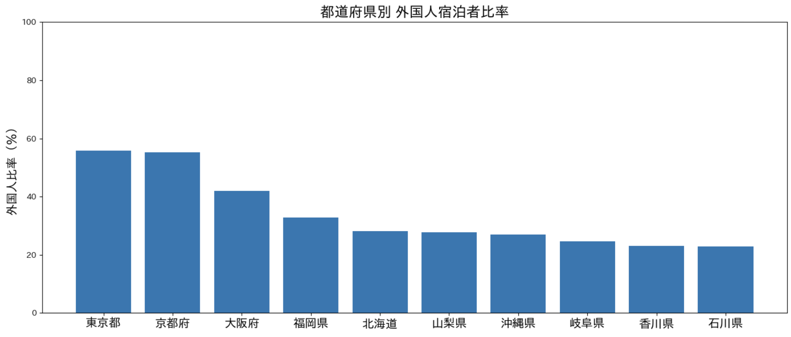
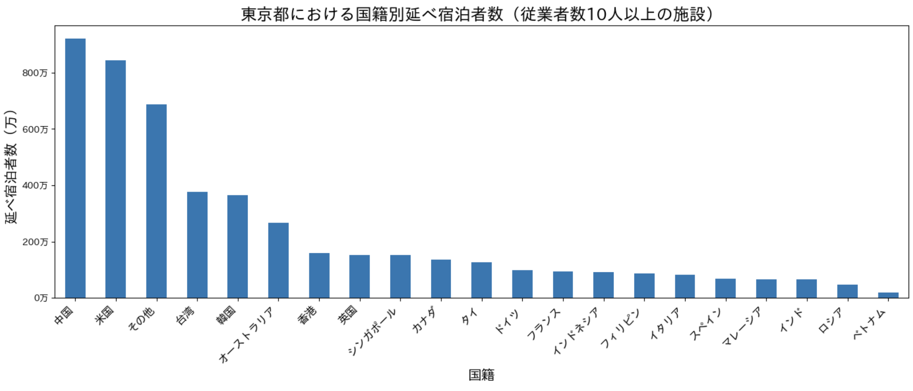
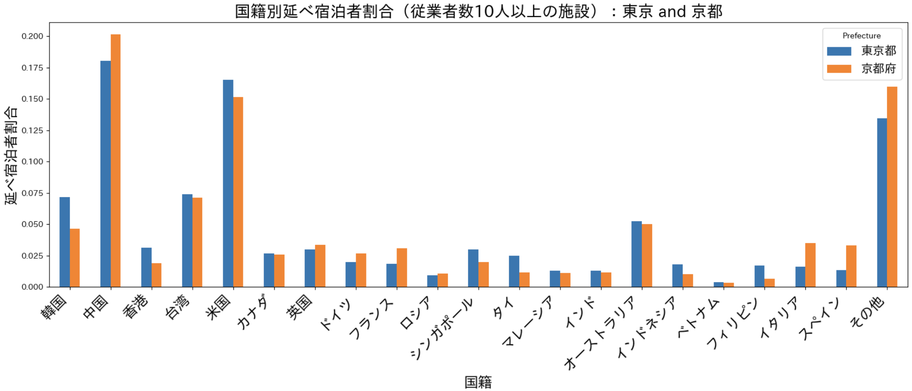
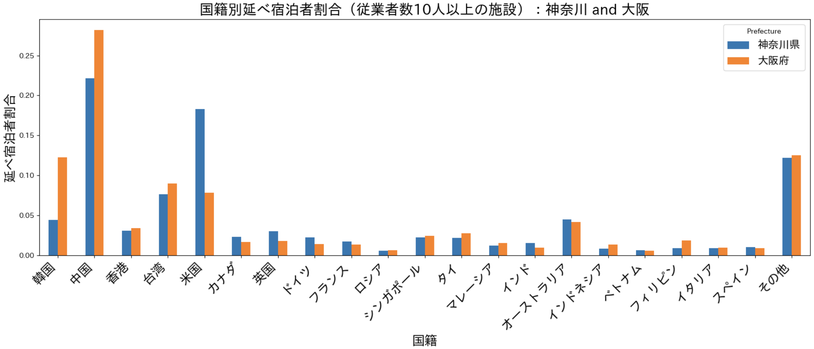

# Regional Concentration of Inbound Tourism in Japan

## Overview
This project analyzes regional differences in inbound tourism across Japan using the 2025 Accommodation Travel Statistics released by the Japan Tourism Agency.

The analysis focuses on three key dimensions:
- Foreign guest ratio by prefecture
- Tourism scale based on total guest nights
- Nationality composition of foreign visitors 

Using ranking analysis, scatter plots, correlation analysis, and clustering, this project explores how inbound tourism is distributed across Japanese prefectures and identifies different regional tourism patterns.

## Data Source
Japan Tourism Agency（観光庁）Accommodation Travel Statistics（宿泊旅行統計調査）

2025年（令和7年）1月~12月分（年間の速報値) 集計結果：
https://www.mlit.go.jp/kankocho/tokei_hakusyo/shukuhakutokei.html

## Key Findings

- Tokyo and Kyoto recorded the highest foreign guest ratios (around 55%).
- Osaka and Hokkaido showed the largest tourism scale outside Tokyo.
- Tourism scale and foreign guest ratio had a relatively strong positive correlation.
- Nationality composition varied significantly across major destinations. Tokyo showed the most balanced international mix, Osaka relied more heavily on East Asian markets such as China and South Korea, while Kyoto attracted a relatively larger share of long-haul Western visitors.

## Visualizations
### Foreign Tourist Ratio by Prefecture (Top 10, 2025)

This figure shows the share of foreign tourists in total overnight stays by prefecture in 2025 (top 10).

Tokyo and Kyoto record the highest ratios at around 55%, followed by Osaka at over 40%. 
In contrast, most other prefectures fall within the 20–30% range.

### Tourism Scale by Prefecture (Top 15, excluding Tokyo)

This figure compares the scale of tourism across prefectures using total guest nights, normalized to Tokyo (=100%).
#### Key Observations
- Osaka and Hokkaido show the largest tourism scale outside Tokyo, indicating strong nationwide attraction.
- Kyoto and Okinawa form a second tier, reflecting their established positions as major tourist destinations.
- Prefectures in the Greater Tokyo Area (e.g., Chiba, Kanagawa) and regional hubs (e.g., Fukuoka, Aichi, Shizuoka) also maintain substantial tourism volumes.

The distribution suggests that tourism in Japan is not purely concentrated in a single region, but rather supported by multiple regional centers.

### Tokyo Foreign Guest Nights by Nationality

This figure shows foreign guest nights in Tokyo by nationality. China and the United States account for the largest volumes, followed by Taiwan and South Korea. The composition suggests that Tokyo functions as a globally diversified gateway rather than relying on a single source market.

### Tokyo Kyoto Nationality Share Comparison

- East Asia + US dominate both cities — China, Korea, Taiwan, and the US together account for roughly half of all stays in each.
- Kyoto leans more toward China; Tokyo toward Korea and the US — the gaps aren't huge, but they're consistent.
- Kyoto's "Other" share is notably higher (~16% vs ~13%), suggesting a more globally diverse visitor base compared to Tokyo's more regionally concentrated one.

### Kanagawa Osaka Nationality Share Comparison

This figure compares nationality shares between Kanagawa and Osaka. Osaka depends more heavily on East Asian markets such as China and South Korea, while Kanagawa shows a stronger presence of Western visitors, especially from the United States.

### The Correlation between “Nationality Composition” and “the Proportion of Foreign Tourists”

#### Key Observations
##### Canada, Spain, and Italy show a “positive correlation”
- The higher the proportion of foreign tourists, the higher the number tends to be
##### Taiwan, Hong Kong, and Vietnam show a “negative correlation”
- They may be widely dispersed across rural areas
##### South Korea shows almost no correlation, while China falls somewhere in between
- Trends in East Asia vary depending on nationality

## Conclusion
Inbound tourism in Japan is concentrated in several major destinations, but visitor composition varies widely across prefectures. Both tourism scale and nationality structure help explain regional tourism patterns.
